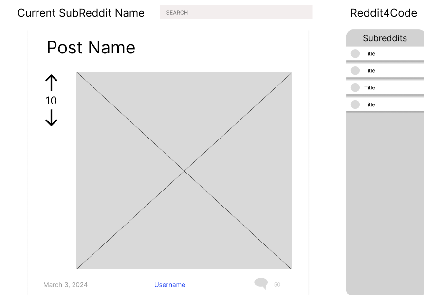
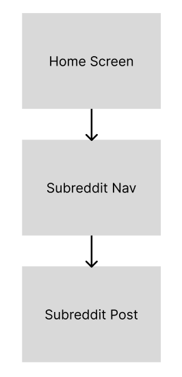

# Reddit 4 Code

## Introduction

This is a minimalized reddit application that showcases a group of preselected subreddits. The target audience is developers who want to keep up with the latest news and trends in the tech industry.

### Scope

This app allows users to view posts from a group of preselected subreddits.

#### Users can:

-   Select a subreddit from a list of preselected subreddits
-   View a list of posts from the selected subreddit
-   View the details of a post, including comments, when the post was uploaded, the author, and the amount of comments
-   simulate an upvote or downvote of a post (no actual voting will be done).
-   View any media contained with the post (images, videos, etc.)
-   View the number of upvotes the post has received.
-   Search the current subreddit for posts that match the search term.
-   Log in to reddit for API access

#### Users cannot:

-   Post comments or posts
-   Upvote or downvote posts
-   View posts from subreddits not included in the preselected list
-   View posts from a user's feed
-   View posts from any other subreddit not included in the preselected list.
-   Do anything that requires a reddit account.
-   View any media that is not directly linked in the post.

## Technologies Used

This project is a static front-end only app and will be the following technologies:

-   React: React has been chosen for its ease of use and flexibility in creating reusable components.
-   Redux: Redux has been chosen to manage the state of the app and to allow for easy access to the state from any component.
-   SCSS: SCSS has been chosen to allow for easy styling of the app and to allow for the use of variables, mixins, and modules.
-   React-Router: React-Router has been chosen to allow for easy navigation between different parts of the app.
-   Jest: Jest has been chosen for its ease of testing with React components.
-   Enzyme: Enzyme has been chosen to allow for easy testing of JS functions.
-   RTL: RTL has been chosen to allow for easy testing of React components.
-   Netlify: Netlify has been chosen to host the app and to allow for easy deployment of the app.
-   GitHub Actions: GitHub Actions has been chosen to allow for continuous integration and continuous deployment of the app.
-   Reddit API: The Reddit API has been chosen to allow for easy access to the posts from the preselected subreddits.

## System Overview

### Architecture

This app will be divided into reusable React components, each responsible for a distinct aspect of the UI.

-   **App** - the **App** component will be the top level component. _Routes_ will be stored within the **App** component.
-   **Root** - The **Root** component will contain the header, navigation bar, footer, and an outlet for the main content of the app.
-   **Navbar** - The **Navbar** component will contain the navigation links to each subreddit and allow the user to navigate between subreddits.
-   **Pages** - Each subreddit will be a _route_ to a _page_ that will act as the _parent_ for all _post_ related components.
-   **PostList** - The **PostList** component will contain a list of posts from the selected subreddit.
-   **Post** - The **Post** component will contain the details of a post, including the title, author, date, number of comments, and the post content.
-   **Searchbar** - The **Searchbar** component will allow the user to search the current subreddit for posts that match the search term.

### State Management

The state of the app will be managed with Redux. The state will be divided into two main parts: the **subreddit** state and the **post** state.

-   **Subreddit State** - The **subreddit** state will contain the list of preselected subreddits and the currently selected subreddit.

-   **Post State** - The **post** state will contain the list of posts from the currently selected subreddit and the search term.

Each page will have a container that is responsible for interaction with the Redux store and passing the state to the child components. Containers will not contain any JSX and will only be responsible for passing props to the child components.

### Design Principles

This project will follow the DRY (Don't Repeat Yourself) principle. This means that components will be designed to be reusable and will not contain any repeated code. This will allow for easy maintenance and updates to the app. This project will also follow SOLID principles. This means that components will be designed to be single-responsibility and will only be responsible for one aspect of the UI. This will allow for easy testing and debugging of the app.

## Features and Functional Requirements

### Features List

-   **Select a Subreddit** - The user can select a subreddit from a list of preselected subreddits.
-   **View Posts** - The user can view a list of posts from the selected subreddit.
-   **View Post Details** - The user can view the details of a post, including comments, when the post was uploaded, the author, and the amount of comments.
-   **Upvote/Downvote Post** - The user can simulate an upvote or downvote of a post (no actual voting will be done).
-   **View Media** - The user can view any media contained with the post (images, videos, etc.).
-   **View Upvotes** - The user can view the number of upvotes the post has received.
-   **Search Posts** - The user can search the current subreddit for posts that match the search term.

-   **Dynamic Content Retrieval from Reddit API** - The app will retrieve posts data of the preselected subreddits from the Reddit API and display them in the app. This will be handled asynchronously to ensure that the app remains responsive and informative during data loading.
    -   **Implementation** - Utilize Redux async thunks for making API calls. This will include creating thunks that dispatch actions based on the success or failure of the Reddit API requests.
    -   **User Experience** - The app will display a loading bar while the data is being fetched from the Reddit API. This will provide feedback to the user that the app is working on retrieving the data.

### Use Cases

-   **Select a Subreddit** - The user clicks on a subreddit from the list of preselected subreddits. The app displays the posts from the selected subreddit.
-   **Upvote/Downvote Post** - The user clicks on the upvote or downvote button of a post. The app then indicates to the user that the post has been upvoted or downvoted without applying the vote to the post.
-   **Search Posts** - The user enters a search term in the search bar. Is the user types within the search bar, the app actively searches through the available posts and only displays the posts that match the search term.
-   **View Post Comments** - The user clicks on a comment button of a post. The app then displays the comments of the post.

## User Interface Design

Each component that relies on external data from the Reddit API includes a visually engaging loading state. For instance, the PostList component displays a spinner animation until the fetch operation completes. This approach keeps users informed about the ongoing data retrieval process, enhancing the overall user experience.

### Desktop

  
_Showing home screen_

### Mobile

  
_Showing homw and navbar expanded_

### Navigation Flow

  
_Navigation flow of app_

## Testing Strategy

This app will be tested with Jest, Enzyme, and RTL. The app will be divided into components, and each component will be tested individually. The app will be tested with unit tests, integration tests, and end-to-end tests. The key components and features that will be tested are:

-   **UI Components** - Each UI component will be tested with unit tests to ensure that the component renders correctly and that the component's behavior is as expected.
-   **State Management** - The state management of the app will be tested with integration tests to ensure that the state is being managed correctly and that the state is being passed to the correct components.
-   **Utility Functions** - Utility functions will be tested with unit tests to ensure that the functions return the correct values and that the functions behave as expected.
-   **User Interaction** - User interaction will be tested with end-to-end tests to ensure that the user can interact with the app as expected and that the app responds correctly to user input.
-   **Async Data Fetching** - Test async thunks responsible for Reddit API calls to ensure they correctly manage the state throughout the lifecycle of a request (pending, fulfilled, and rejected).
-   **Loading States** - Verify that components correctly render loading indicators during data retrieval and properly render the content once data is fetched.

## Deployment

<!-- Briefly describe how you plan to deploy the app on Netlify, including any steps for CI/CD if you plan to use GitHub Actions for automatic deployment. -->

Upon release, the app will be deployed on Netlify. The app will be deployed using the Netlify CLI, which will allow for easy deployment and management of the app. The app will be deployed with continuous integration and continuous deployment (CI/CD) using GitHub Actions. This will allow for automatic deployment of the app when changes are made to the codebase.

## Versioning and Updates

<!-- Changelog: Keep a section for updates and changes. As you progress in your development, update this section to reflect modifications or additions to the project plan. -->

### 1

-   **0.0** _(4/5/24)_ - Initial design setup
